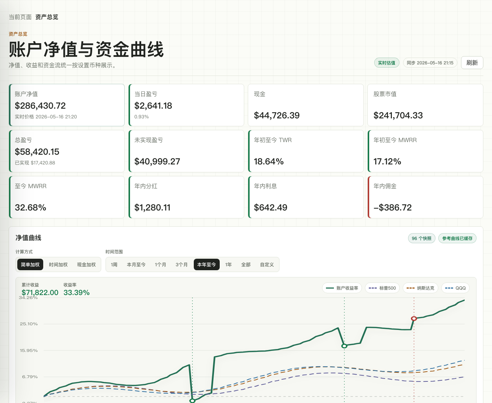
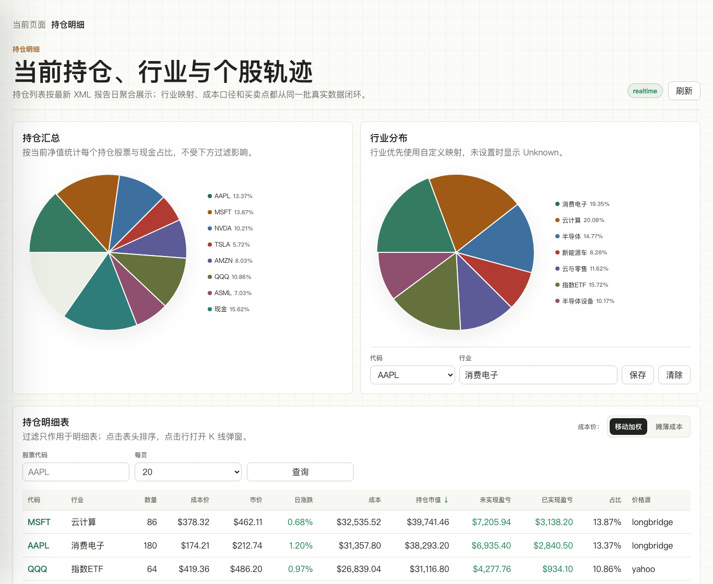
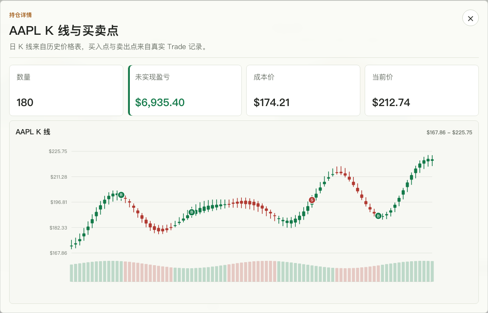
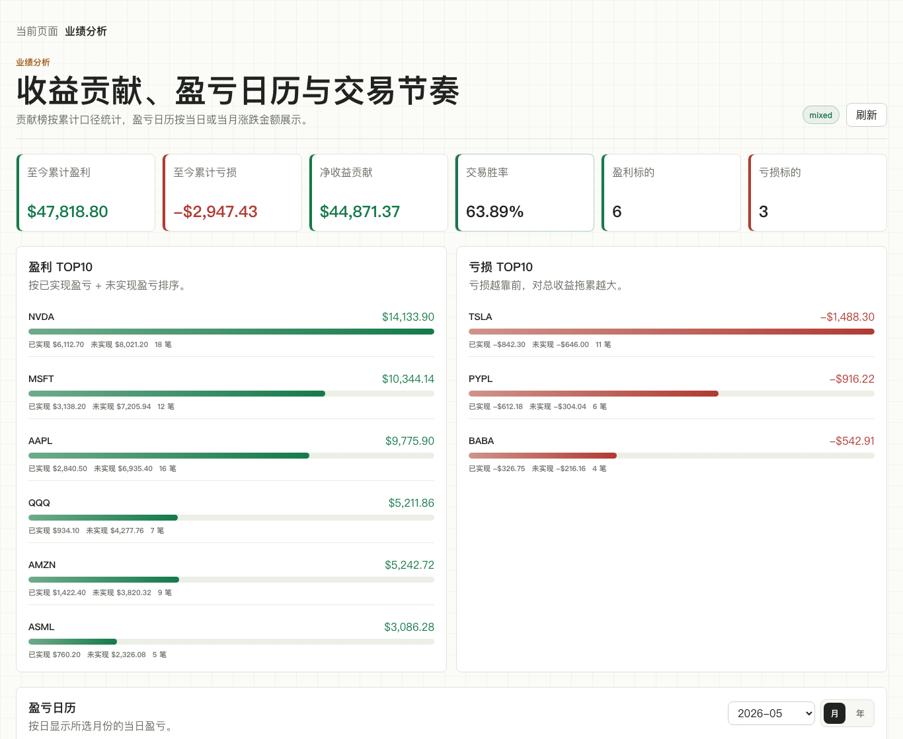
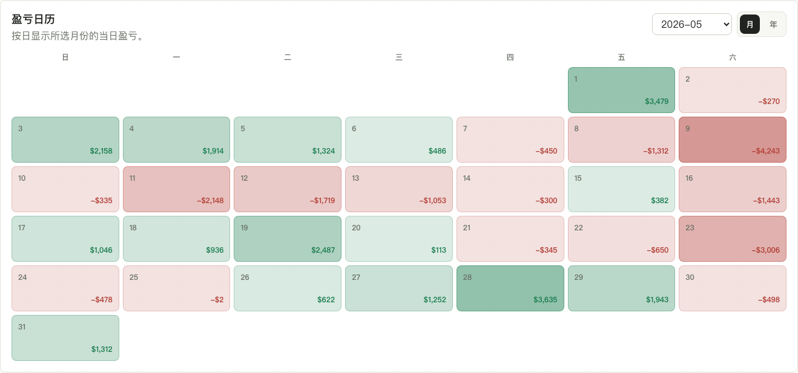
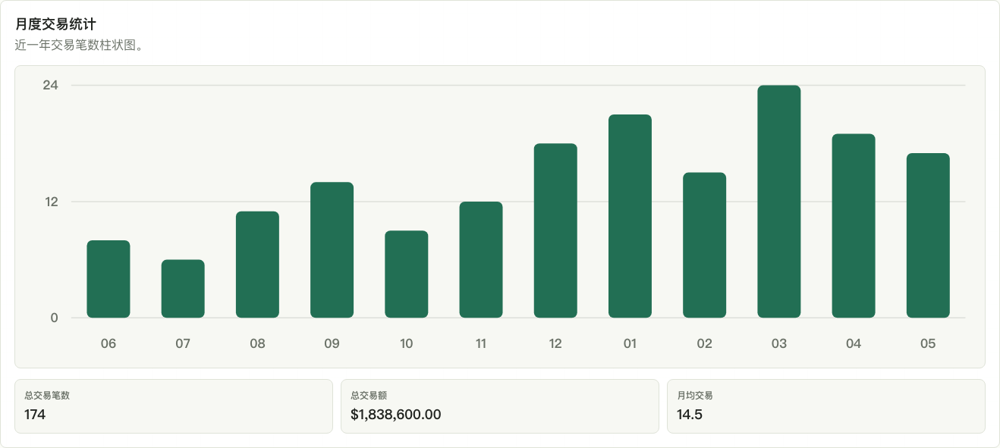
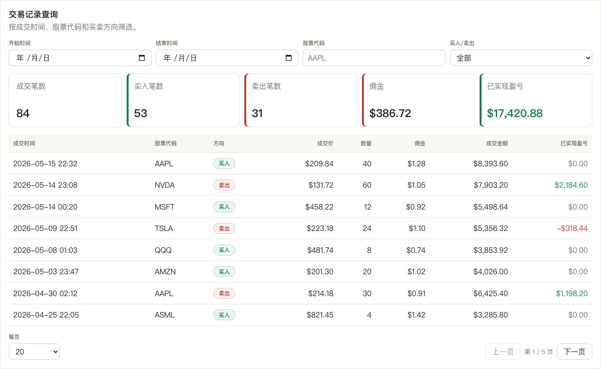
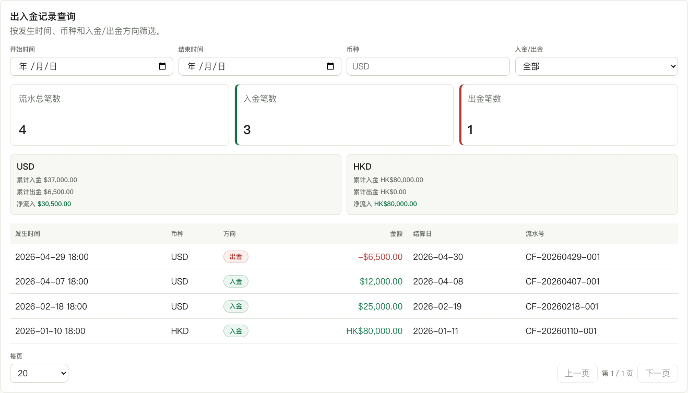
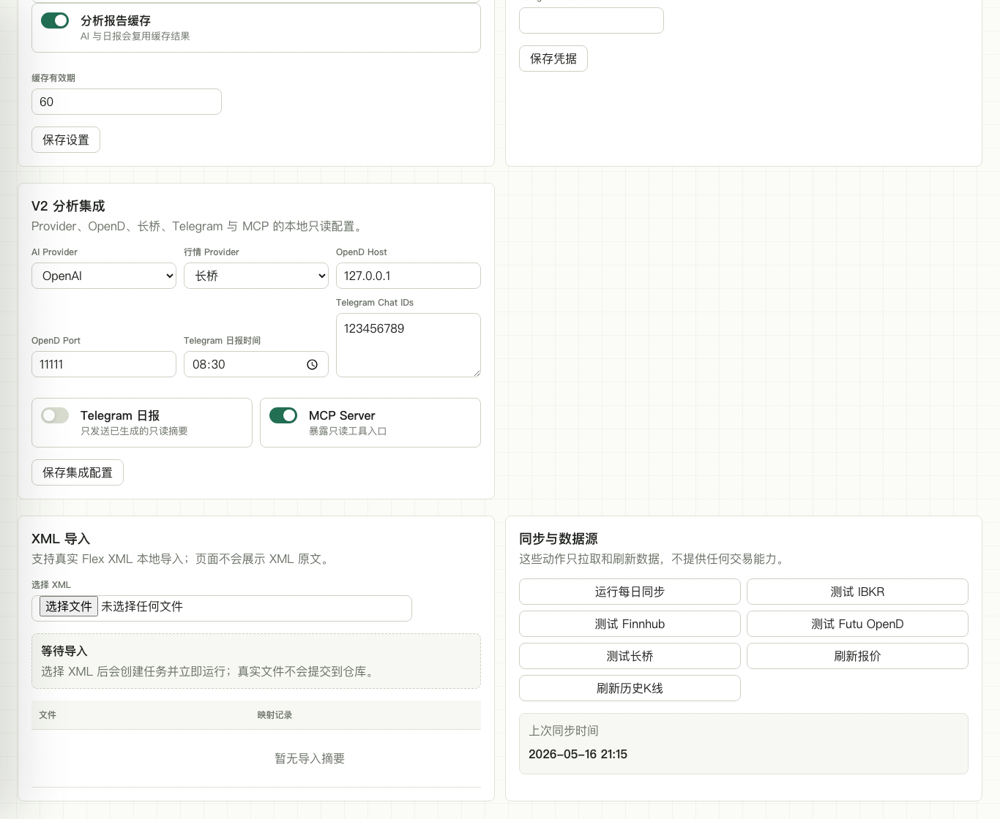
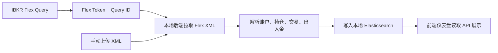

# IBKR Dashboard V1 推广文案

> 配图使用脱敏演示数据生成，不包含真实账户、真实资产金额或真实交易记录。发布前可以保留演示图，也可以替换成你愿意公开的截图。

## 标题建议

把 IBKR Flex XML 变成本地投资仪表盘：净值、持仓、交易和买卖点一次看清

## 一句话介绍

IBKR Dashboard 是一个本地运行的 IBKR 投资分析看板：读取 Interactive Brokers Flex XML，把账户净值、持仓结构、业绩表现、交易记录和出入金记录整理成可交互的可视化页面。它只做只读分析，不提供交易、下单、撤单或风控功能。

## 适合谁

- 使用 IBKR，并且希望复盘自己的真实账户数据。
- 不想把交易数据上传到第三方投资记账网站。
- 希望用图表看清净值曲线、资金流、行业分布、持仓明细和个股操作记录。
- 希望未来把自己的持仓数据接入 AI 客户端做进一步分析。

## V1 已经支持什么

### 1. 资产总览：净值、收益和资金流放在一张图里

V1 的资产总览会展示账户净值、现金、股票市值、总盈亏、已实现盈亏、未实现盈亏、年内分红、利息和佣金等核心指标。

净值曲线是 V1 的重点功能：

- 支持 1 周、本月至今、1 个月、3 个月、本年至今、1 年、全部和自定义区间。
- 支持简单加权、时间加权和现金加权三种收益口径。
- 支持和标普 500、纳斯达克、QQQ 等基准曲线对比。
- 会把入金、出金事件标在曲线上，避免只看净值时误判收益来源。

这意味着你可以同时回答几个常见问题：账户到底赚了多少、收益来自投资还是入金、近期表现是否跑赢基准、不同统计口径下结果是否一致。

### 2. 持仓明细：从单只股票扩展到行业和组合结构

持仓页不只是普通表格。V1 会同时展示：

- 持仓股票和现金的组合占比。
- 行业分布饼图。
- 自定义行业映射，适合把 ETF、ADR、跨行业公司或自己定义的主题分类统一整理。
- 持仓明细表，包含数量、成本价、市价、日涨跌、持仓市值、未实现盈亏、已实现盈亏、组合占比和价格源。
- 成本价支持移动加权和摊薄成本切换。

这页适合用来快速检查组合是否过度集中、行业暴露是否偏离预期，以及哪些股票贡献了主要盈亏。

### 3. 点击持仓，直接看到个股 K 线和真实操作点

点击持仓明细表中的股票，可以打开个股详情弹窗。K 线来自历史价格数据，买入点和卖出点来自 IBKR Flex XML 中的真实 Trade 记录。

这个功能适合做交易复盘：你可以看到买入、卖出发生在价格走势的哪个位置，而不是只在流水表里看一行行交易记录。

### 4. 业绩分析：盈利、亏损、胜率和交易节奏一起看

业绩分析页会把持仓和交易数据整理成更适合复盘的视角：

- 至今累计盈利、累计亏损、净收益贡献。
- 交易胜率、盈利标的数量、亏损标的数量。
- 盈利 TOP10 和亏损 TOP10，并拆出已实现盈亏、未实现盈亏和交易笔数。

这页适合回答“到底是谁在贡献收益、谁在拖累收益、收益是不是集中在少数标的上”。

盈亏日历会按天展示组合盈亏变化，绿色代表正贡献，红色代表负贡献，颜色深浅反映金额大小。它比单纯看月度收益更直观，适合定位波动发生在哪些交易日。

月度交易统计会展示近一年每个月的交易笔数、总交易额和月均交易频率，帮助你判断自己近期是更偏高频调仓，还是更偏长期持有。

### 5. 交易明细：成交和出入金分开查

交易明细页把成交记录和出入金记录拆成两个独立查询。交易记录支持按成交时间、股票代码和买卖方向筛选，并展示成交价、数量、佣金、成交金额和已实现盈亏。

这部分适合查具体某只股票的操作历史，也适合核对佣金和已实现盈亏。

出入金查询支持按发生时间、币种和入金/出金方向筛选，并按币种汇总累计入金、累计出金和净流入。它和净值曲线上的资金流标注是同一条数据链路：既可以在图上看资金流影响，也可以回到明细表查原始流水。

### 6. 设置、导入和同步都在本地完成

V1 支持两种数据进入方式：

- 本地导入 Flex XML：在“设置与导入”页面选择 XML 文件，系统解析账户快照、持仓、交易、现金流水和汇率等数据。
- IBKR Flex 在线同步：填写 Flex Token 和 Query ID 后，可以手动运行每日同步，也可以按设置的频率定时拉取。

同步流程可以理解为：

整个项目坚持本地优先和只读分析：真实 XML 不会提交到仓库，凭据保存在本地设置里，页面和后端都不提供交易动作。

## V1 的核心亮点

- 数据来自 IBKR Flex XML，账务口径更贴近真实账户。
- 净值曲线支持多时间范围、多收益计算方式，并能和基准指数对比。
- 入金和出金直接标注在曲线上，避免把资金流误当成投资收益。
- 持仓页同时看个股、现金、行业和自定义分类。
- 点击持仓表即可查看个股 K 线和买卖点，复盘更直观。
- 业绩分析把盈利榜、亏损榜、盈亏日历和月度交易频率放在一起。
- 交易明细区分成交记录和出入金流水，便于核对佣金、已实现盈亏和资金流。
- 本地运行，只读分析，不把真实交易数据上传到第三方服务。

## V2 计划

V2 会在 V1 的基础上继续补齐细节，并把分析能力从“看清数据”推进到“解释数据”。

主要方向：

- 完善 V1 细节：继续优化净值、持仓、交易、出入金、行情缓存和数据缺失状态。
- AI 持仓分析：围绕当前组合输出因子暴露、集中度、相关性、尾部风险、主题暴露、宏观敏感性和对冲防御思路。
- AI 个股分析：针对持仓股票输出方向判断、核心变化、组合影响、产业链传导、市场误判、风险和观察信号。
- MCP 只读服务：把本地持仓、风险摘要、市场分析和个股分析暴露为 MCP 工具，接入 Claude Desktop、Codex Desktop 等 AI 客户端。
- 市场数据与情绪分析：接入行情、市场温度、社区热度、基准数据等来源，辅助判断当前市场环境和组合风险。
- Telegram 日报：在本地生成只读摘要后，按白名单 Chat ID 推送日报。

V2 仍然保持同一个边界：只读分析，不交易，不下单，不解锁交易权限。

## 发布配图顺序

1. 资产总览：先让读者看到净值曲线、收益口径、基准对比和入金标注。
2. 持仓明细：展示行业分布、自定义行业和持仓表。
3. 个股 K 线：突出点击持仓后可以复盘买卖点。
4. 业绩分析：用收益贡献榜、盈亏日历和月度交易统计说明复盘能力。
5. 交易明细：用成交流水和出入金流水说明数据可以回溯到明细。
6. 设置与同步：解释 Flex XML、本地导入、在线同步和只读数据源。
